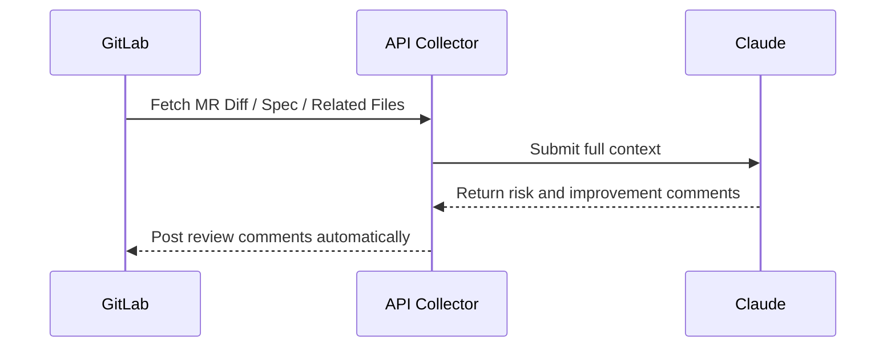

## Reference: AI Code Review Efficiency Improvement with Model Context Protocol (MCP)

### 1. What is MCP? Objectives

**Model Context Protocol (MCP)** is a framework designed to structure and organize the "context" required by LLMs (Large Language Models) to perform precise code and design reviews.

#### ✅ MCP Objectives

- Enable LLMs to simultaneously understand "code," "specifications," "design," "dependencies," and "history"
- Conduct reviews with consideration of the "entire project context" beyond individual diffs or files
- Provide accurate feedback and suggestions by comprehending design intentions and background

---

### 2. Setup and Preparation for MCP (Assuming Claude Usage)

#### ✅ Claude Usage Prerequisites (API Specifications)

- Anthropic Claude (Claude 3 Opus or higher recommended)
- Define the AI's role and purpose using `system_prompt`
- Pass **multiple contexts** via `user_prompt` or tool-use
- Recommend using JSON Mode (Structured Output)

---

#### ✅ Specification Preparation and Ticket Template

Accurate AI-driven reviews require well-prepared specifications. Include the following fields in the ticket to provide clear review standards for the AI.

##### Specification Ticket Template Example

```
## Feature Overview (What)
- Describe the new feature or modification

## Background / Purpose (Why)
- Business context or technical rationale

## Acceptance Criteria
- [ ] Condition 1: Do X when Y
- [ ] Condition 2: Return Z on error

## Non-Functional Requirements (Performance / Security)
- Specify any performance or security constraints

## Boundary / Edge Cases
- Expected behavior for edge cases or exceptions

## Related Data / API / UI Specifications
- Links or descriptions of impacted DB tables, APIs, or UI designs
```

By following this format, the AI can better detect specification gaps, design flaws, and missing coverage.

---

#### ✅ Example MCP Design (Data Structure for Submission)

```json
{
  "model": "claude-3-opus",
  "system_prompt": "You are an expert Laravel reviewer. Read the following context and detect design issues, security risks, or performance problems.",
  "context": {
    "diff": "git diff content",
    "spec": "GitLab ticket content / specifications",
    "models": ["User.php", "Order.php"],
    "services": ["OrderService.php"],
    "db_schema": "orders, users table design",
    "test_cases": ["tests/Feature/OrderTest.php"]
  },
  "user_prompt": "Please review the diff and report risks, SRP violations, and missing tests."
}
```

---

### 3. Implementation Example

#### ✅ Auto-fetch Required Information from GitLab

```python
diff = gitlab_api.get_merge_request_diff(mr_id)
spec = gitlab_api.get_issue_description(issue_id)
models = get_related_models(diff)  # Auto-extract related classes
tests = get_related_tests(diff)

context = {
    "diff": diff,
    "spec": spec,
    "models": models,
    "test_cases": tests
}
```

#### ✅ Sample Claude API Call (Python)

```python
from anthropic import Anthropic

client = Anthropic(api_key="sk-xxxx")

response = client.messages.create(
    model="claude-3-opus",
    system="You are a senior Laravel reviewer...",
    messages=[{"role": "user", "content": str(context)}],
    max_tokens=4000
)

print(response.content)
```

---

### 4. MCP Operational Flow Example



---

### 5. Example Output (Generated by Claude)

```json
{
  "design_issues": [
    "OrderService violates SRP by handling both payment and inventory logic."
  ],
  "security_risks": ["Possible SQL injection in raw query on line 45."],
  "performance": ["Potential N+1 problem in Order::with('items')"],
  "test_suggestions": [
    "Missing test case for canceling an order already shipped."
  ]
}
```

---

### 6. Operational Considerations and Practical Usage

- **Specification Ticket Quality**: Ensure background, purpose, and acceptance criteria are detailed.
- **Automated Dependency Analysis**: Use call graphs or other tools to extract impact range.
- **Human Review of AI Output**: Always treat AI results as suggestions; human confirmation is mandatory.
- **Future Expansion into CI/CD Possible**

#### ✅ Recommended Execution Strategy for MCP AI Review

| Item              | Details                                                                           |
| ----------------- | --------------------------------------------------------------------------------- |
| **Primary Usage** | Execute locally or via dedicated scripts only for PRs that require review         |
| **Within CI/CD**  | Regular static analysis and tests in CI/CD; MCP runs as a **manual optional job** |
| **Example**       | Define `manual trigger` job in `.gitlab-ci.yml`                                   |

##### Example (GitLab Manual Job)

```yaml
mcp_ai_review:
  stage: review
  script:
    - python ai_review.py
  when: manual
```

#### Conclusion

Since MCP reviews cover design and specifications, they are best applied selectively to critical PRs and separated from routine CI automation.

---

### Summary

MCP is a new approach enabling AI to comprehend the entire project context. It offers the following benefits:

- **Early detection of design and specification errors**
- **Automated impact visualization**
- **Improved balance of review quality and speed**

Combined with state-of-the-art LLMs like Claude, MCP provides a practical foundation for AI-assisted code reviews.
