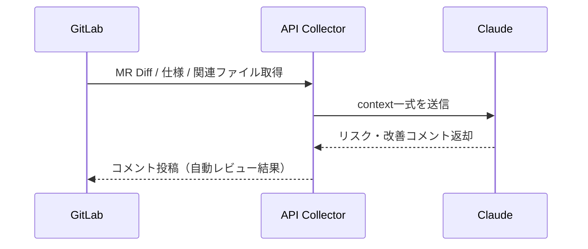

# 参考：Model Context Protocol（MCP）による AI コードレビュー効率化

## 1. MCP とは何か？ 目指しているもの

**Model Context Protocol（MCP）** は、LLM（大規模言語モデル）がコードレビューや設計レビューを正確に実施するために必要な「文脈（Context）」を構造化・体系化するための考え方・プロトコルである。

### ✅ MCP の目的

- LLM に「コード」「仕様」「設計」「依存関係」「履歴」などを同時に認識させる
- Diff や単一ファイルだけでなく、「プロジェクト全体像」を踏まえたレビューを可能にする
- 設計意図や背景も理解した、精度の高い指摘・提案を実現する

---

## 2. MCP を使うための設定・準備（Claude 前提）

### ✅ Claude の活用前提（API 仕様）

- Anthropic Claude（特に Claude 3 Opus 以上）
- `system_prompt` で AI の役割・目的を明示
- `user_prompt`（または tool-use）で**複数コンテキストを渡す**
- JSON モード（Structured Output）推奨

---

### ✅ 仕様情報の準備とチケットテンプレート

MCP 型 AI レビューを精度高く機能させるためには、仕様情報（チケット）の充実が不可欠である。以下の項目を必ず記載し、AI に正確なレビュー基準を与える。

#### 仕様チケット記載項目（テンプレート例）

```
## 機能概要（What）
- どの機能を追加・変更するのか

## 背景・目的（Why）
- ビジネス背景や技術的意図

## 受け入れ条件（Acceptance Criteria）
- [ ] 条件1: ◯◯の場合は××となること
- [ ] 条件2: エラー時は△△を返すこと

## 非機能要件（Performance / Security）
- パフォーマンス、セキュリティ制約

## 例外・エラーケース（Boundary / Edge Cases）
- 想定する異常系・境界値とその期待動作

## 関連データ・API・画面仕様
- 影響するDBテーブル・API・画面設計へのリンクや説明
```

上記フォーマットに従うことで、AI は仕様漏れ・設計ミス・網羅性不足を検出しやすくなる。

---

- Anthropic Claude（特に Claude 3 Opus 以上）
- `system_prompt` で AI の役割・目的を明示
- `user_prompt`（または tool-use）で**複数コンテキストを渡す**
- JSON モード（Structured Output）推奨

---

### ✅ MCP 設計例（送信データ構造）

```json
{
  "model": "claude-3-opus",
  "system_prompt": "You are an expert Laravel reviewer. Read the following context and detect design issues, security risks, or performance problems.",
  "context": {
    "diff": "git diff 内容",
    "spec": "GitLabチケット内容・仕様",
    "models": ["User.php", "Order.php"],
    "services": ["OrderService.php"],
    "db_schema": "orders, users テーブル設計",
    "test_cases": ["tests/Feature/OrderTest.php"]
  },
  "user_prompt": "Please review the diff and report risks, violations of SRP, and missing tests."
}
```

---

## 3. 具体的な実装イメージ

### ✅ GitLab から必要情報を自動収集

```python
diff = gitlab_api.get_merge_request_diff(mr_id)
spec = gitlab_api.get_issue_description(issue_id)
models = get_related_models(diff)  # 依存クラス自動抽出
tests = get_related_tests(diff)

context = {
    "diff": diff,
    "spec": spec,
    "models": models,
    "test_cases": tests
}
```

### ✅ Claude API への投げ方（Python 例）

```python
from anthropic import Anthropic

client = Anthropic(api_key="sk-xxxx")

response = client.messages.create(
    model="claude-3-opus",
    system="You are a senior Laravel reviewer...",
    messages=[{"role": "user", "content": str(context)}],
    max_tokens=4000
)

print(response.content)
```

---

## 4. MCP を用いた運用フロー（イメージ）



---

## 5. 想定されるアウトプット例（Claude 生成）

```json
{
  "design_issues": [
    "OrderService violates SRP by handling both payment and inventory logic."
  ],
  "security_risks": ["Possible SQL injection in raw query on line 45."],
  "performance": ["Potential N+1 problem in Order::with('items')"],
  "test_suggestions": [
    "Missing test case for canceling an order already shipped."
  ]
}
```

---

## 6. 運用上のポイント・現実的な活用方法

- **仕様チケットの充実**：背景、意図、AC（受け入れ条件）を記述しておく
- **コードの依存解析自動化**：影響範囲の抽出ロジックが背（Call Graph）
- **AI 出力のレビュー（最終判断は人間）**：そのままマージせず、あくまで補助として使う
- **将来的には CI/CD 連携へ拡張可能**

### ✅ MCP 型 AI レビュー運用場所の考察

#### ローカル実行 / レビューワー手動実行を推奨

| 項目                   | 内容                                                                                |
| ---------------------- | ----------------------------------------------------------------------------------- |
| **主運用**             | ローカル or 専用スクリプトベースで、レビュー時に必要な PR のみ実行                  |
| **CI/CD の中での運用** | 通常の静的解析・テストは CI/CD に組み込む。MCP 型は **オプション Job** として別線化 |
| **例**                 | `.gitlab-ci.yml` 内に `manual trigger` Job を設置                                   |

#### 例（GitLab Manual Job）

```yaml
mcp_ai_review:
  stage: review
  script:
    - python ai_review.py
  when: manual
```

#### 結論

MCP 型レビューは、設計・仕様まで踏み込むため、重要 PR へのみ適用し、日常の CI 自動化から切り離した運用が現実的である。

---

## まとめ

MCP は、AI に「プロジェクト全体を理解させる」ための新しいアプローチであり、以下の効果が期待できる。

- **設計・仕様ミスの早期発見**
- **影響範囲の自動可視化**
- **レビュー品質・スピードの両立**

Claude など最新 LLM の機能と組み合わせることで、実用的な AI コードレビュー支援の基盤となる。
