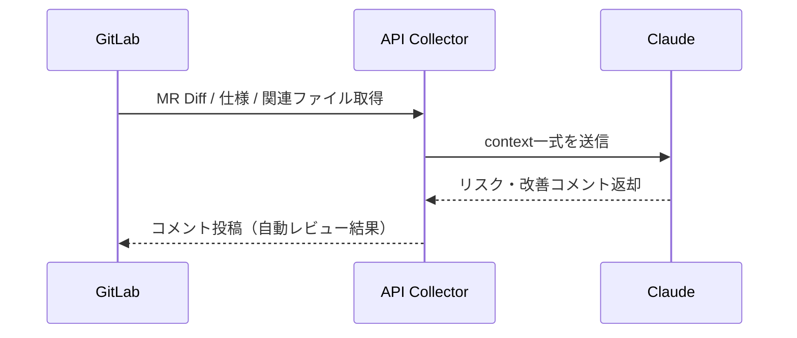

# コードレビュー運用ガイドライン 〜品質・生産性・AI 活用までを視野に入れた実践指針〜

(2025/03/26 @kurab)

## サマリー

本ガイドラインは、ソフトウェア開発におけるコードレビューの目的、観点、役割分担、運用フロー、および AI 活用（Model Context Protocol - MCP）までを体系的にまとめたものである。従来のコードレビューによる品質担保に加え、AI や静的解析ツールを効果的に活用し、開発速度と品質の両立を目指す。特にレガシーコードへの対応や CI/CD との役割分担、MCP による次世代コードレビュー運用モデルまでを網羅する。

## 目次

1. コードレビューの目的と効果
2. コードレビューの観点
3. コードレビューの役割分担
4. レガシーコードへの配慮と現実的な運用の注意点
5. CI/CD とローカル実行の役割分担
6. 具体的な Action（実行手順とタイミング＋具体例）
7. 参考：Model Context Protocol（MCP）による AI コードレビュー効率化

---

# 1. コードレビューの目的と効果

## 1.1 コードレビューの目的

コードレビューは、ソースコードを第三者が確認し、品質向上を図る工程とする。主な目的は以下の通り。

- **バグの早期発見**
- **コードの可読性・保守性向上**
- **設計の妥当性検証**
- **チーム全体の技術力向上（ナレッジ共有）**
- **セキュリティリスクの低減**

## 1.2 コードレビューによる効果

- **品質向上**：バグ・設計ミスの早期発見と修正
- **属人化の防止**：複数メンバーがコードの内容を把握可能となる
- **一貫性の確保**：プロジェクト全体のコーディングスタイルや設計思想の統一
- **学習効果**：若手エンジニアの学習機会を創出

## 1.3 Agile 開発における KAIZEN（継続的改善）への貢献

- **フィードバックループの強化**：短いサイクルでコードの良し悪しを共有し、次の開発に活かす
- **チーム内ナレッジの蓄積**：良い設計や実装パターンの共有と標準化
- **継続的な技術的負債の低減**：気づいたタイミングで改善点を指摘・修正する習慣の形成
- **リファクタリング文化の醸成**：「より良くする」視点を開発サイクルへ組み込む

---

# 2. コードレビューの観点

## 2.1 共通レビュー観点

以下は、プロジェクト全般に共通する基本的なレビュー観点とする。

### 機能・仕様の正確性

- 要件・仕様通りに実装されていること
- 境界値や例外ケースが考慮されていること

### 可読性・保守性

- 変数名、関数名が意味を持ち明確であること
- 必要十分なコメントが記述されていること
- ネストが深すぎず、適切に関数分割されていること

### パフォーマンス

- 不要なループや重い処理が存在しないこと
- データベースや外部 API への無駄なアクセスがないこと

### セキュリティ

- 入力値のバリデーション、サニタイズが適切であること
- SQL インジェクション、XSS、CSRF 等の対策が講じられていること

### テストの充実度

- 必要なテストが実装されていること
- 正常系・異常系を含めた網羅性が確保されていること

### 設計・アーキテクチャ

- 責務分離（単一責任原則）が実現されていること
- 再利用性・拡張性が考慮されていること

### コーディング規約・スタイル

- チームやプロジェクトのコーディング規約に準拠していること
- Linter や Formatter が適用されていること

### 依存関係管理

- 必要最小限のライブラリのみを利用していること
- 依存ライブラリのバージョンが適切であること

### 将来の変更・影響範囲

- 将来的な仕様追加・変更に耐えられる設計となっていること
- 既存コードへの影響範囲が把握されていること

### PR 説明・ドキュメント

- PR 説明文が明確で、仕様・背景・影響範囲が記載されていること
- 必要なマイグレーション情報や設定変更の説明が付記されていること

## 2.2 Laravel 特有のレビュー観点

Laravel に特化した注意事項や、発生しやすいバグパターンも確認対象とする。

- Eloquent ORM における N+1 問題（`with`句の適用漏れ）
- バリデーションは FormRequest クラスで実施されていること
- 生 SQL の使用有無および SQL インジェクション対策
- Facade 多用によるテスト困難化の有無
- マイグレーション・シーディングの設計妥当性
- ルーティング定義の正確性および不要な公開防止
- ミドルウェア（認可・認証・CSRF）の適用漏れがないこと

## 2.3 Angular 特有のレビュー観点

Angular プロジェクトにおける特有の確認観点を以下に示す。

- 型安全性（TypeScript）を確保していること
- 双方向バインディング（`[(ngModel)]`）の適切な使用
- RxJS（Observables）の購読漏れやメモリリークが発生していないこと
- コンポーネントの肥大化を防ぎ、smart / dumb の役割分離ができていること
- モジュール設計（Lazy Load など）の妥当性
- フォームバリデーションが正しく実装されていること
- アクセシビリティ（a11y）への配慮が十分であること

---

# 3. コードレビューの役割分担

## 3.1 静的コード解析やツールでチェックできる項目（自動化推奨）

- コーディング規約・フォーマット（Pint / phpcs）
- Lint チェック（PHPStan / Larastan / ESLint）
- 型チェック（PHPStan / TypeScript）
- デッドコード検出
- SQL インジェクションや XSS などの基本的なセキュリティチェック（Psalm / Snyk / SonarQube）
- N+1 問題の検出（Telescope / Debugbar）
- テストカバレッジ測定（PHPUnit / Jest）
- 依存ライブラリの脆弱性検知（`composer audit` / Snyk）

## 3.2 AI や支援ツールが補助できる領域（今後の拡張）

- Diff ベースの設計ミス・改善提案（AI コードレビューボット）
- PR 説明文の生成支援（LLM 活用）
- 影響範囲の自動解析・可視化支援（AI ＋ Call Graph）
- 過去のレビュー履歴や知見をもとにしたアドバイス提案

## 3.3 人が担当すべき項目（重点確認領域）

- 仕様・設計の正しさ
- ビジネスロジックの妥当性
- 設計意図や責務分離の妥当性
- 将来的な仕様変更・拡張への耐性
- 影響範囲の深掘り（特にレガシー干渉）
- PR 説明・背景・意図の確認
- UX・UI 設計（フロントエンドの場合）

## 3.4 各観点ごとの担当分類表

| カテゴリ                        | 観点・項目                         | ツール                     | 人力 | AI 補助            |
| ------------------------------- | ---------------------------------- | -------------------------- | ---- | ------------------ |
| 機能・仕様の正しさ              | 仕様通りの動き・要件実現           |                            | ◎    | △                  |
| 機能・仕様の正しさ              | 境界値・例外ケース考慮             |                            | ◎    | △                  |
| 可読性・保守性                  | 命名規則チェック                   | ◎（PHPStan / Lint）        | △    | △                  |
| 可読性・保守性                  | コメントの適切さ                   |                            | ◎    | △                  |
| 可読性・保守性                  | ネスト・分割の適切さ               |                            | ◎    | △                  |
| 可読性・保守性                  | 重複・DRY チェック                 | ◎（PHPStan）               | △    | △                  |
| パフォーマンス                  | 無駄なループ・重い処理             | ◎（PHPStan）               | △    | △                  |
| パフォーマンス                  | DB アクセス最適化                  | ◎（Larastan）              | △    | △                  |
| パフォーマンス（Laravel）       | N+1 問題                           | ◎（Telescope / Debugbar）  | △    | △                  |
| セキュリティ                    | 入力バリデーション適切さ           | ◎（Psalm / PHPStan）       | △    | △                  |
| セキュリティ                    | SQL インジェクション対策           | ◎（Psalm / Snyk）          | △    | △                  |
| セキュリティ                    | XSS、CSRF 対策                     | ◎（SonarQube）             | △    | △                  |
| テスト観点                      | カバレッジ測定（量）               | ◎（PHPUnit Coverage）      |      |                    |
| テスト観点                      | テストケースの質・網羅性           |                            | ◎    | △                  |
| 設計・アーキテクチャ            | 責務分離・SRP 原則                 |                            | ◎    | △（Deptrac）       |
| 設計・アーキテクチャ            | 再利用性・拡張性                   |                            | ◎    | △                  |
| コーディング規約・スタイル      | フォーマット・規約                 | ◎（Pint / phpcs）          |      |                    |
| コーディング規約・スタイル      | 型チェック                         | ◎（PHPStan / TS）          |      |                    |
| コーディング規約・スタイル      | デッドコード検出                   | ◎（PHPStan / Psalm）       |      |                    |
| 依存関係                        | 脆弱ライブラリ検出                 | ◎（composer audit / Snyk） | △    |                    |
| 変更影響・拡張性                | 影響範囲特定・考慮                 |                            | ◎    | △（Call Graph）    |
| PR 説明・ドキュメント           | PR 説明・背景の明確さ              |                            | ◎    | △（生成支援）      |
| UI/UX（Angular）                | UI/UX 設計                         |                            | ◎    | △（ESLint / a11y） |
| UI/UX（Angular）                | RxJS 購読・メモリリーク防止        | ◎（ESLint）                | △    | △                  |
| 設計・アーキテクチャ（Angular） | Angular モジュール設計（LazyLoad） |                            | ◎    | △                  |
| フロントエンド実装（Angular）   | フォームバリデーション             |                            | ◎    | △                  |
| UI/UX（Angular）                | アクセシビリティ（a11y）           | ◎（a11y lint）             | △    | △                  |

### ◎・△ の意味（凡例）

| 記号 | 意味             | 説明                                                                                     |
| ---- | ---------------- | ---------------------------------------------------------------------------------------- |
| ◎    | 完全対応・主担当 | その担当（ツール / AI / 人力）が主要な役割としてチェックすべき。完全にカバーできる項目。 |
| △    | 補助・一部対応   | その担当が補助的・部分的に支援できる。ヒントやサポートは可能だが最終判断は人の目が必要。 |

---

# 4. レガシーコードへの配慮と現実的な運用の注意点

レガシーな実装を含むソフトウェアプロジェクトでは、以下の制約や現実的な課題が発生する。

## 4.1 理想と現実のギャップを認識する

- すべてのコードを理想状態に保つことは困難である
- レガシーコード周辺は「現状維持」または「影響範囲を抑えた改善」を優先する

## 4.2 新規コード・修正部分に注力する

- レビュー対象は新規追加・修正部分を中心とし、既存レガシーコードへの過度な介入は避ける
- 既存コードの課題は技術的負債リストに蓄積し、別途リファクタリング対象として管理する

## 4.3 影響範囲の特定と検証を重視する

- レガシーコードとの密結合リスクがあるため、影響範囲の特定を重視する
- 可能な限りユニットテスト・結合テストを実施し、検証する

## 4.4 完璧主義ではなく継続的改善を優先する

- 1 回のレビューで完璧を目指すのではなく、継続的な改善を重視する
- チーム内で妥協点と改善ポイントの共通認識を形成する

---

# 5. CI/CD とローカル実行の役割分担

コード品質を担保しつつ、開発効率を最大化するためには、機械的・自動的に実施する項目と、開発者の判断・作業によって実施する項目を明確に区別する必要がある。

以下に、役割分担を行う理由を示す。

- **すべての検証を CI/CD に組み込むと、実行時間が長くなり、開発速度の低下につながる**
- **ローカルで実行可能な項目は、開発者が自身のタイミングで実施することで効率化できる**
- **フォーマットや Lint などは、IDE（例：VSCode）やプラグインによる自動実行が可能であり、開発フローへ自然に組み込むことで CI/CD への過度な依存を回避できる**

このような設計により、CI/CD ではプロジェクト全体の品質チェックを機械的に担保し、開発者は設計・仕様・影響範囲など、思考を要する項目に集中できる運用とする。

---

### ✅ CI/CD（gitlab-ci）で実行すべきもの

| 項目                       | ツール                 | 理由・効果                                                       |
| -------------------------- | ---------------------- | ---------------------------------------------------------------- |
| 静的解析（型・設計）       | PHPStan（Larastan）    | 型ミス・設計漏れの早期検知。CI で全体をチェックし、品質担保      |
| 静的解析（セキュリティ）   | Psalm / Composer Audit | 依存ライブラリの脆弱性含めて機械検出可能                         |
| ユニットテスト・カバレッジ | PHPUnit                | 品質担保の基盤として必須。継続的に品質を維持するために CI で実行 |

### ✅ ローカル実行（開発時に開発者が実行すべきもの）

#### 🔹 開発者が実行するもの（開発フロー内に組み込み）

| 項目                           | ツール                           | 理由・効果                                                           |
| ------------------------------ | -------------------------------- | -------------------------------------------------------------------- |
| コーディング規約・フォーマット | Laravel Pint / VSCode プラグイン | 保存時自動フォーマットでコーディング規約遵守。IDE で対応し開発効率化 |

#### 🔹 開発者・レビュー担当者が実行・確認するもの

| 項目            | ツール                         | 理由・効果                                                   |
| --------------- | ------------------------------ | ------------------------------------------------------------ |
| N+1 検知        | Laravel Telescope / Debugbar   | 実行時でないと検知困難なため、開発・レビュータイミングで確認 |
| AI 補助レビュー | ChatGPT / Copilot / LLM ツール | 仕様漏れ・設計ミスの指摘補助（開発・レビュー時活用）         |
| E2E テスト      | Laravel Dusk / Cypress         | 本番相当環境が必要なため、必要時実行。レビュー時にも活用可能 |

---

# 6. 具体的な Action（実行手順とタイミング＋具体例）

5 章で分類したそれぞれの役割ごとに、実際の運用手順・タイミングと具体的な設定・手順を以下に示す。

---

## ✅ CI/CD（gitlab-ci）で実行すべきものの具体的アクション

| 項目                       | アクション                                                       | 実行タイミング                 |
| -------------------------- | ---------------------------------------------------------------- | ------------------------------ |
| 静的解析（型・設計）       | `php artisan code:analyse` または `./vendor/bin/phpstan analyse` | Merge Request 作成時、自動実行 |
| 静的解析（セキュリティ）   | `./vendor/bin/psalm` 実行 + `composer audit`                     | Merge Request 作成時、自動実行 |
| ユニットテスト・カバレッジ | `./vendor/bin/phpunit --coverage-text`                           | Merge Request 作成時、自動実行 |

### `.gitlab-ci.yml` 設定例

```yaml
static_analysis:
  stage: test
  script:
    - composer install
    - ./vendor/bin/phpstan analyse --memory-limit=512M

security_check:
  stage: test
  script:
    - composer install
    - ./vendor/bin/psalm
    - composer audit

unit_test:
  stage: test
  script:
    - composer install
    - ./vendor/bin/phpunit --coverage-text
```

---

## ✅ ローカル実行（開発者が実行するもの）の具体的アクション

| 項目                           | アクション                                                     | 実行タイミング         |
| ------------------------------ | -------------------------------------------------------------- | ---------------------- |
| コーディング規約・フォーマット | VSCode 保存時に Laravel Pint / Prettier などで自動フォーマット | 各ファイル保存時に常時 |

### VSCode 設定例

```json
{
  "editor.formatOnSave": true,
  "editor.defaultFormatter": "shufo.vscode-pint"
}
```

---

## ✅ ローカル実行（開発者・レビュー担当者が実行・確認するもの）の具体的アクション

| 項目            | アクション                                                                            | 実行タイミング                                    |
| --------------- | ------------------------------------------------------------------------------------- | ------------------------------------------------- |
| N+1 検知        | ローカルで `php artisan serve` → Telescope / Debugbar でクエリ内容確認                | 開発中およびコードレビュー時の任意タイミング      |
| AI 補助レビュー | PR 作成前に AI（ChatGPT / Copilot）へ `diff` または `コード全文` を投げてレビュー補助 | PR 作成前、レビュー前のタイミング                 |
| E2E テスト      | `php artisan dusk` 実行 or Cypress で E2E シナリオテスト実施                          | 開発完了後、PR 前・レビュー前など必要なタイミング |

### 実行手順・確認方法

#### N+1 検知手順

```bash
php artisan serve
```

- ブラウザで対象画面を操作
- `/telescope/requests` を確認し、クエリ・N+1 発生状況をチェック
- 必要に応じて `with()` や `load()` を追加し改善

#### AI 補助レビュー手順

```bash
git diff > diff.patch
```

- ChatGPT や Copilot に以下のテンプレートでレビュー依頼

**レビュー依頼テンプレート（ChatGPT 用）**

```
以下のコード差分（diff）をレビューしてください。

【確認してほしいポイント】
- バグの可能性がある箇所
- N+1やパフォーマンス問題
- 責務の分離が適切か（SRP違反がないか）
- テスト観点の漏れがないか

--- diff start ---
（ここにdiff内容を貼り付け）
--- diff end ---
```

- AI の指摘・提案を確認し、必要に応じて修正

#### E2E テスト手順

##### Laravel Dusk 実行手順

```bash
php artisan dusk
```

- テスト結果（ログ・スクショ）を確認

##### Cypress 実行手順

```bash
npx cypress open
```

- Cypress GUI が立ち上がるので、該当テストシナリオを実行
- 実行結果・スクリーンショット・動画を確認可能

---

この運用により、機械に任せるチェックは CI/CD 側で徹底し、人の判断が必要な項目はローカルやレビュー時に重点的に確認する運用を実現する。

---

# 7. 参考：Model Context Protocol（MCP）による AI コードレビュー効率化

## 7.1 MCP とは何か？ 目指しているもの

**Model Context Protocol（MCP）** は、LLM（大規模言語モデル）がコードレビューや設計レビューを正確に実施するために必要な「文脈（Context）」を構造化・体系化するための考え方・プロトコルである。

### ✅ MCP の目的

- LLM に「コード」「仕様」「設計」「依存関係」「履歴」などを同時に認識させる
- Diff や単一ファイルだけでなく、「プロジェクト全体像」を踏まえたレビューを可能にする
- 設計意図や背景も理解した、精度の高い指摘・提案を実現する

---

## 7.2 MCP を使うための設定・準備（Claude 前提）

### ✅ Claude の活用前提（API 仕様）

- Anthropic Claude（特に Claude 3 Opus 以上）
- `system_prompt` で AI の役割・目的を明示
- `user_prompt`（または tool-use）で**複数コンテキストを渡す**
- JSON モード（Structured Output）推奨

---

### ✅ 仕様情報の準備とチケットテンプレート

MCP 型 AI レビューを精度高く機能させるためには、仕様情報（チケット）の充実が不可欠である。以下の項目を必ず記載し、AI に正確なレビュー基準を与える。

#### 仕様チケット記載項目（テンプレート例）

```
## 機能概要（What）
- どの機能を追加・変更するのか

## 背景・目的（Why）
- ビジネス背景や技術的意図

## 受け入れ条件（Acceptance Criteria）
- [ ] 条件1: ◯◯の場合は××となること
- [ ] 条件2: エラー時は△△を返すこと

## 非機能要件（Performance / Security）
- パフォーマンス、セキュリティ制約

## 例外・エラーケース（Boundary / Edge Cases）
- 想定する異常系・境界値とその期待動作

## 関連データ・API・画面仕様
- 影響するDBテーブル・API・画面設計へのリンクや説明
```

上記フォーマットに従うことで、AI は仕様漏れ・設計ミス・網羅性不足を検出しやすくなる。

---

- Anthropic Claude（特に Claude 3 Opus 以上）
- `system_prompt` で AI の役割・目的を明示
- `user_prompt`（または tool-use）で**複数コンテキストを渡す**
- JSON モード（Structured Output）推奨

---

### ✅ MCP 設計例（送信データ構造）

```json
{
  "model": "claude-3-opus",
  "system_prompt": "You are an expert Laravel reviewer. Read the following context and detect design issues, security risks, or performance problems.",
  "context": {
    "diff": "git diff 内容",
    "spec": "GitLabチケット内容・仕様",
    "models": ["User.php", "Order.php"],
    "services": ["OrderService.php"],
    "db_schema": "orders, users テーブル設計",
    "test_cases": ["tests/Feature/OrderTest.php"]
  },
  "user_prompt": "Please review the diff and report risks, violations of SRP, and missing tests."
}
```

---

## 7.3 具体的な実装イメージ

### ✅ GitLab から必要情報を自動収集

```python
diff = gitlab_api.get_merge_request_diff(mr_id)
spec = gitlab_api.get_issue_description(issue_id)
models = get_related_models(diff)  # 依存クラス自動抽出
tests = get_related_tests(diff)

context = {
    "diff": diff,
    "spec": spec,
    "models": models,
    "test_cases": tests
}
```

### ✅ Claude API への投げ方（Python 例）

```python
from anthropic import Anthropic

client = Anthropic(api_key="sk-xxxx")

response = client.messages.create(
    model="claude-3-opus",
    system="You are a senior Laravel reviewer...",
    messages=[{"role": "user", "content": str(context)}],
    max_tokens=4000
)

print(response.content)
```

---

## 7.4 MCP を用いた運用フロー（イメージ）



---

## 7.5 想定されるアウトプット例（Claude 生成）

```json
{
  "design_issues": [
    "OrderService violates SRP by handling both payment and inventory logic."
  ],
  "security_risks": ["Possible SQL injection in raw query on line 45."],
  "performance": ["Potential N+1 problem in Order::with('items')"],
  "test_suggestions": [
    "Missing test case for canceling an order already shipped."
  ]
}
```

---

## 7.6 運用上のポイント・現実的な活用方法

- **仕様チケットの充実**：背景、意図、AC（受け入れ条件）を記述しておく
- **コードの依存解析自動化**：影響範囲の抽出ロジックが背（Call Graph）
- **AI 出力のレビュー（最終判断は人間）**：そのままマージせず、あくまで補助として使う
- **将来的には CI/CD 連携へ拡張可能**

### ✅ MCP 型 AI レビュー運用場所の考察

#### ローカル実行 / レビューワー手動実行を推奨

| 項目                   | 内容                                                                                |
| ---------------------- | ----------------------------------------------------------------------------------- |
| **主運用**             | ローカル or 専用スクリプトベースで、レビュー時に必要な PR のみ実行                  |
| **CI/CD の中での運用** | 通常の静的解析・テストは CI/CD に組み込む。MCP 型は **オプション Job** として別線化 |
| **例**                 | `.gitlab-ci.yml` 内に `manual trigger` Job を設置                                   |

#### 例（GitLab Manual Job）

```yaml
mcp_ai_review:
  stage: review
  script:
    - python ai_review.py
  when: manual
```

#### 結論

MCP 型レビューは、設計・仕様まで踏み込むため、重要 PR へのみ適用し、日常の CI 自動化から切り離した運用が現実的である。

---

## まとめ

MCP は、AI に「プロジェクト全体を理解させる」ための新しいアプローチであり、以下の効果が期待できる。

- **設計・仕様ミスの早期発見**
- **影響範囲の自動可視化**
- **レビュー品質・スピードの両立**

Claude など最新 LLM の機能と組み合わせることで、実用的な AI コードレビュー支援の基盤となる。
